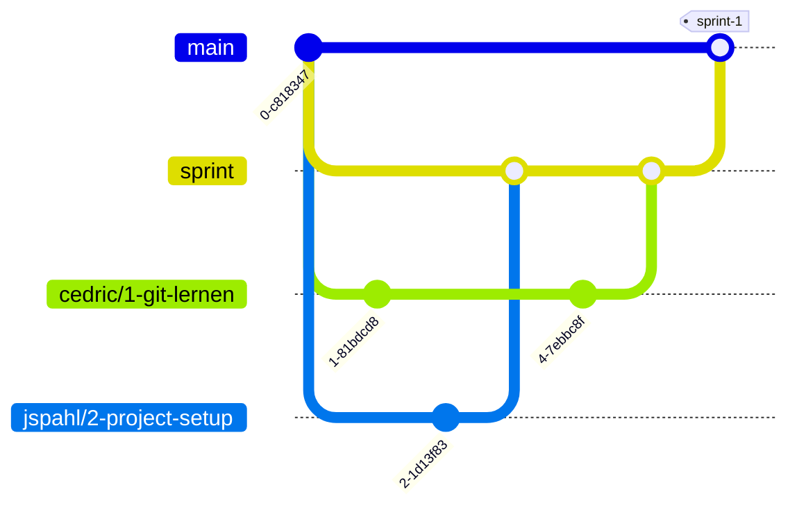
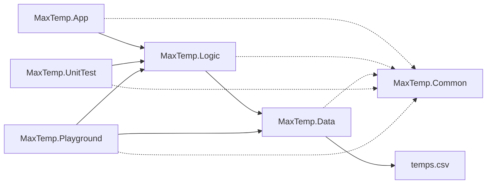

# MaxTemp

## Dokumentation zu verschiedene Themen

[Depenency Injection](docs/DI.md)

## Organisation

### Strategie für dieses Git Projekt

Wir werden in diesem Git Projekt folgene Strategie der Branches benutzen

Unser Hauptbranch wird `main` sein von dort wird der `sprint` branch erzeugt.
Nach jedem Sprint wird der `sprint`-Branch in `main` gemerged.
Für jedes Ticket wird ein neuer branch erstellt mit folgendem Namen: `<bearbeiter>/<ticket-id>-<name-of-ticket>`.
für #2 z.b. `jasper/2-project-setup`

### Projekt Setup

Unser Projekt ist wie folgt aufgebaut:

#### MaxTemp.App

Die App ist die Hauptanwendung.
Sie ist für die Interaktion mit dem Benutzer zuständig.
Das heißt nur Daten ausgeben und Benutzereingaben entgegennehmen.
Alle anderen Aufgaben werden an die `MaxTemp.Logic` weitergegeben.

#### MaxTemp.Logic

Die Logic ist für die Logik der Anwendung zuständig.
Sie ist in der Lage die Daten aus der `MaxTemp.Data` zu verarbeiten und auszugeben.

#### MaxTemp.Data

Die Data ist für die Datenhaltung zuständig.
Sie ist in der Lage Daten aus einer CSV Datei zu lesen.
Die Daten werden in einem `List<T>` gespeichert.

#### MaxTemp.Playground

Der Playground ist ein Projekt in dem wir unsere Ideen ausprobieren können.
Er ist nicht Teil der Anwendung und wird im Endprodukt nicht vorhanden sein.

#### MaxTemp.UnitTest

Der UnitTest ist für die Tests der Anwendung zuständig.

#### MaxTemp.Common

Das Common Projekt ist für alle gemeinsamen Klassen zuständig.

## Git

### Git Grundlagen

Git ist ein dezentrales Versionsverwaltungssystem.
Es ist in der Lage Änderungen an Dateien zu verfolgen und zu speichern.
Dadurch ist es möglich Änderungen an Dateien rückgängig zu machen oder zu vergleichen.

Hier sind nur die wichtigsten Informationen zu Git aufgelistet.

Weitere Informationen zu Git findest du in diesem [Video (en)](https://www.youtube.com/watch?v=RGOj5yH7evk).
Ein Cheat Sheet findest du [hier](https://training.github.com/downloads/de/github-git-cheat-sheet/).
Genaue Details findest du in der [Dokumentation (en)](https://git-scm.com/docs).

#### Git Befehle

##### git clone

Mit dem Befehl `git clone <url>` wird ein Git Repository heruntergeladen.

##### git init

Mit dem Befehl `git init` wird ein neues Git Repository erstellt.
Dieser Befehl sollte nur einmal pro Repository ausgeführt werden.

##### git add

Mit dem Befehl `git add <file>` wird eine Datei zum Index hinzugefügt.
Der [Index](https://git-scm.com/about/staging-area) ist eine Liste von Dateien die in den nächsten Commit aufgenommen werden sollen.

##### git commit

Mit dem Befehl `git commit` wird ein neuer Commit erstellt.
Ein Commit ist eine Zusammenfassung von Änderungen an Dateien.
Ein Commit sollte immer nur eine Aufgabe erledigen.
Zum Beispiel: "Füge eine neue Methode hinzu" oder "Füge eine neue Klasse hinzu".

Falls sich beim Commiten vim öffnet kannst du mit `:q!` schließen.
damit das nicht mehr passiert kannst du mit `git config --global core.editor "nano"` den Editor ändern. 

Um schnell einen Commit zu erstellen kannst du `git commit -m "<message>"` benutzen.
Dabei ist `<message>` die Commit Message.

> Ich bin dafür das wir [gitmoji](https://gitmoji.dev) [:octocat:](https://github.com/carloscuesta/gitmoji) benutzen um die Commit Message zu schreiben.

##### git status

Mit dem Befehl `git status` wird der Status des Repositories angezeigt.
Es wird angezeigt welche Dateien geändert wurden und welche Dateien zum Index hinzugefügt wurden.

##### git log

Mit dem Befehl `git log` wird eine Liste aller Commits angezeigt.
Es werden die Commit ID, der Autor, das Datum und die Commit Message angezeigt.

##### git diff

Mit dem Befehl `git diff` wird der Unterschied zwischen dem letzten Commit und dem aktuellen Stand angezeigt.
Es werden die Zeilen angezeigt die hinzugefügt oder entfernt wurden.

##### git branch

Mit dem Befehl `git branch` wird eine Liste aller Branches angezeigt.
Es wird angezeigt welcher Branch aktuell ausgewählt ist.

Mit dem Befehl `git branch <name>` wird ein neuer Branch erstellt.

##### git checkout

Mit dem Befehl `git checkout <name>` wird der Branch gewechselt.
Es wird der Branch mit dem Namen `<name>` ausgewählt.

##### git merge

Mit dem Befehl `git merge <name>` wird der Branch `<name>` in den aktuellen Branch gemerged.
Das heißt alle Änderungen die im Branch `<name>` gemacht wurden werden in den aktuellen Branch übernommen.

> Das ist für uns nur relevant wenn wir bei einem Pull Request, Merge Conflict haben.
    um den Merge Conflict zu lösen müssen wir den `sprint` Branch in den aktuellen Branch mergen.

##### git push

Mit dem Befehl `git push` werden alle Commits die noch nicht auf dem Server sind auf den Server geladen.

##### git pull

Mit dem Befehl `git pull` werden alle Commits die auf dem Server sind heruntergeladen und gemerged.

#### Pull Request

Ein Pull Request ist eine Anfrage an die anderen Teammitglieder einen Branch in einen anderen Branch zu mergen.
In unserem Fall wird ein Pull Request erstellt wenn ein Ticket fertig ist und der Branch in den `sprint` Branch gemerged werden soll.

#### Code Review

Ein Code Review ist eine Überprüfung der Änderungen die in einem Pull Request gemacht wurden.
Hierbei wird überprüft ob die Änderungen den Coding Guidelines entsprechen und ob die Änderungen sinnvoll sind.
Außerdem wird überprüft ob die Tests noch funktionieren und der Code die richtige Logic hat.

### Git Workflow

#### Git Workflow für ein Ticket

1. Erstelle einen neuen Branch mit dem Namen `<bearbeiter>/<ticket-id>-<name-of-ticket>`
   - um einen neuen Branch zu erstellen musst du auf den `sprint` Branch wechseln: `git checkout sprint`
   - achte darauf das der `sprint` Branch aktuell ist: `git pull`
   - dann erstellst du den Branch: `git branch <bearbeiter>/<ticket-id>-<name-of-ticket>`
   - dann wechselst du auf den Branch: `git checkout <bearbeiter>/<ticket-id>-<name-of-ticket>`
2. Arbeite an dem Ticket
    - denke daran dein Ticket auf `In Progress` zu setzen
3. Füge alle Dateien die du geändert hast zum Index hinzu
    - um ein einzelne Datei hinzuzufügen: `git add <file>`
    - um alle Dateien hinzuzufügen: `git add .`
    - du kannst mit `git status` überprüfen welche Dateien zum Index hinzugefügt wurden
    - du kannst mit `git rm --cached <file>` eine Datei aus dem Index entfernen
4. Erstelle einen Commit mit einer aussagekräftigen Commit Message
    - um einen Commit zu erstellen: `git commit`
    - du kannst mit `git log` überprüfen ob der Commit erstellt wurde
    - du kannst mit `git diff` überprüfen ob du alle Änderungen zum Commit hinzugefügt hast
    - falls du etwas vergessen hast kannst du es nachdem du es zum Index hinzugefügt hast mit `git commit --amend` zum
      letzten Commit hinzufügen
5. Push den Branch auf den Server
   - um den Branch auf den Server zu pushen: `git push -u origin <bearbeiter>/<ticket-id>-<name-of-ticket>`
   - falls du den Branch schon einmal gepusht hast kannst du einfach `git push` benutzen
   - falls du nicht immer `git push -u origin <bearbeiter>/<ticket-id>-<name-of-ticket>` schreiben willst kannst du mit
     `git config --global push.autoSetupRemote true` einstellen das der richtige Branch und Server automatisch ausgewählt werden 
6. Erstelle einen [Pull Request](#pull-request)
   - entweder auf der Webseite von GitHub oder mit `gh pr create --base sprint` (du musst dafür das GitHub CLI installiert haben)
   - wähle als Ziel den `sprint` Branch
   - wähle als Quelle deinen Branch
   - wähle als Reviewer die anderen Teammitglieder aus
   - schau nach ob dem Pull Request ein Ticket zugeordnet ist
   - setze dein Ticket auf `In Review`
7. Warte auf die Code Review
   - mehr Informationen dazu findest du im Abschnitt [Code Review](#code-review)
8. Wenn der Pull Request genehmigt wurde, wird der Branch in den `sprint` Branch gemerged

