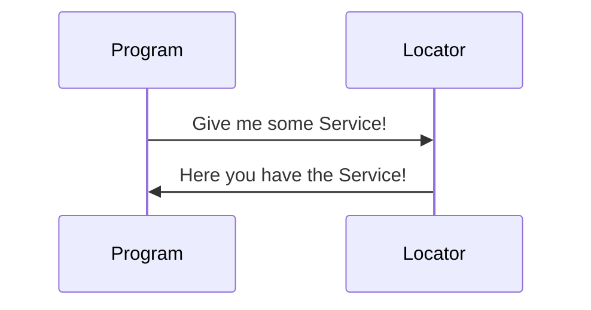

# Dependency Injection

> Als **[Dependency Injection](https://de.wikipedia.org/wiki/Dependency_Injection)** (**DI**, englisch *dependency* ‚Abhängigkeit‘ und *injection* ‚Injektion‘, deutsch *Abhängigkeitsinjektion* oder *Einbringen von Abhängigkeiten*) wird in der objektorientierten Programmierung ein Entwurfsmuster bezeichnet, welches die Abhängigkeiten eines Objekts zur Laufzeit reglementiert: Benötigt ein Objekt beispielsweise bei seiner Initialisierung ein anderes Objekt, ist diese Abhängigkeit an einem zentralen Ort hinterlegt – es wird also nicht vom initialisierten Objekt selbst erzeugt. 
> ~ Wikipedia

Wir benutzen in unserem Projekt dafür das Nuget Packet [Splat](https://www.nuget.org/packages/Splat), da wir wegen Avalonia die Abhängigkeit dazu bereits haben

## Benutzung



### Beispiel anhand des [TemperatureService](../MaxTemp.Logic/TemperatureService.cs)

Der TemperatureService benötugt eine Reference zum TemperatureRepository um die ausgelesenen Daten analysieren zu können.

Eine Möglichkeit dieses Problem zu lösen ist es, das TemperatureRepository von Service erstellen zu lassen.

```csharp
class TempService {
    private TempRepository _repo;
    public TempService()
    {
        _repo = new TempRepository();
    }
}
```

Das ist unpraktisch da man z.B. beim automatisierten testen dann nicht mehr die Logic des Services isolieren kann.
Um das zu vermeiden kann man das Repo auch im Constuctor mitgeben.

```csharp
class TempService {
    private TempRepository repo;
    public TempService(TempRepository repo)
    {
        _repo = repo;
    }
}
```

Was aber wenn man mehrere Services hat die das gleich Repo benötigen?

Um das Problem zu beheben benutzen wir einen ServiceLocator

```csharp
class TempService {
    private TempRepository repo;
    public TempService(TempRepository? repo = null)
    {
        _repo = repo ?? Locator.Current.GetService<TempRepository>();
    }
}
```

Damit der ServiceLocator weiß welche services er benutzen soll müssen wir unsere Services / Repositories registrieren.
In unserm Projekt passiert das [hier](../MaxTemp.App/AppBuilderExtensions.cs)

```csharp
Locator.CurrentMutable.RegisterLazySingleton(() => new TempRepository(), typeof(TempRepository));
Locator.CurrentMutable.RegisterLazySingleton(() => new TempService(), typeof(TempService));
```
